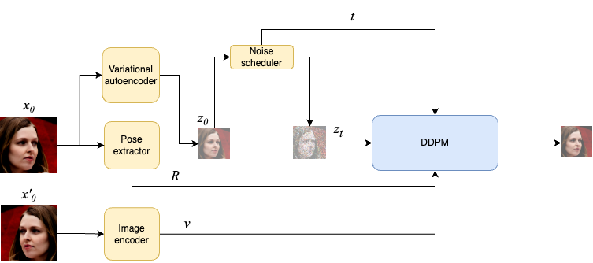

# Novel Face View Synthesis

A project to create a diffusion model that takes as input a single (frontal) photograph of a face and outputs a synthesised image of the same person from a different angle (specified during generation)

### Model

This paper explores the application of diffusion models to solve the problem of generating human head images in various poses. It presents a method for training a model on a dataset of photographs of different people without additional geometric information. A diffusion model based on [Stable Diffusion v1.4](https://huggingface.co/runwayml/stable-diffusion-v1-4) was trained as an implementation of the method. During training, pairs of symmetrical face images from the [FFHQ](https://github.com/NVlabs/ffhq-dataset) dataset were used. This research demonstrates the potential of the method in the field of creating new face images and confirms the applicability of diffusion models for solving this problem.

Checkpoints from: [Image Variation Hagging Face](https://huggingface.co/lambdalabs/sd-image-variations-diffusers)

### Method

For each image of a person $x'$ we obtain a symmetric
reflection with respect to the vertical axis $x'$, using an auxiliary model we determine the position of the person's head with respect to the camera. During training, we will use x as the target and a pair $(x', R)$ as the conditions, where $R$ is the mutual position of the head in the
both images. Thus, the data distribution has the form $q(x_0, x'_0, R)$.

**The objective:** 

$$L = \mathbb{E}_{\mathcal{E}(\mathbf{x_t}), \mathcal{I}(\mathbf{x_t}), R, \mathbf{\epsilon} \sim \mathcal{N}(\mathbf{0}, \mathbf{I})} \| \mathbf{\epsilon} - \mathbf{\epsilon}_\theta(\mathcal{E}(\mathbf{x_t}), t, \mathcal{I}(\mathbf{x_t}), R) \|^2$$

### Results of model performance 

#### Diffusion process: 

#### Examples:

